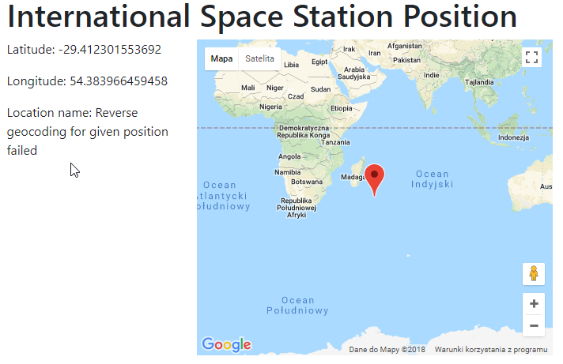

# ISS Position

Simple application obtaining information about current position of ISS from [https://wheretheiss.at/](https://wheretheiss.at/).

Position of ISS is additionally reverse geocoded with Google Maps API to display human readable format.

Position is also displayed on the map.



## Install and run application
PHP in version 7.2 needs to be installed and running.

### PHP built-in server
Fastest way of running application is using built-in PHP server:
```bash
git clone git@github.com:mhyndle/iss-position.git

# install composer dependencies
cd iss-position
composer install

# run built-in PHP server inside `public` folder
cd public
php -S localhost:8000
``` 
Application will be available at [http://localhost:8000](http://localhost:8000)

### Vagrant
To assure same system configuration, you cun run application in Vagrant for which configuration is provided.
```bash
git clone git@github.com:mhyndle/iss-position.git

# create VM (it may take a while on first run)
cd iss-position
vagrant up

# install composer dependencies on VM
vagrant ssh
cd /var/www/iss-position
composer install
``` 
Add entry in hosts file `192.168.1.50 www.iss-position.loc`

Application will be available at [http://www.iss-position.loc](http://www.iss-position.loc) on your host machine.

## Development
Components used in application:

### Unit tests
```bash
# without coverage
./vendor/bin/phpunit --color --no-coverage

# generate coverage report in `testReports/coverage.html`
./vendor/bin/phpunit --color
```


### Code Sniffer
```bash
./vendor/bin/phpcs ./src --colors --standard=phpcs-ruleset.xml
``` 